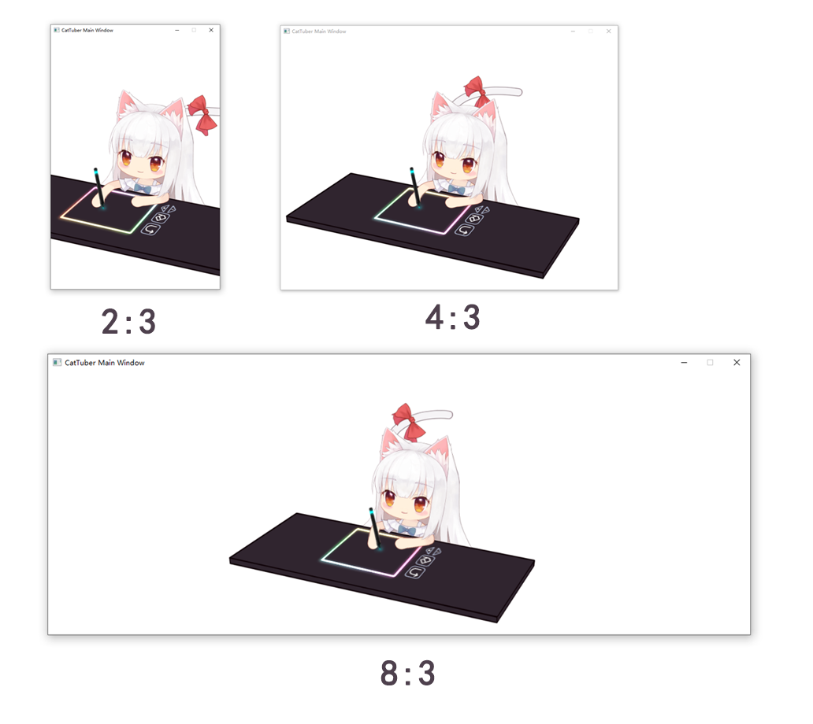

# 模型在CatTuber软件中是如何显示的

在目前版本中，CatTuber没有单独移动、缩放某个模型的功能，模型画布总是会居中，高度与窗口高度一致。

CatTuber的画面由多个模型组成，想让各个模型的位置都在预期之内，最推荐的做法是让需要同框出现的模型的画布大小和比例一致。这样在Cubism Editor中角色鼠标桌子位置关系正确的话，在CatTuber中就也能保持正确的位置关系。

### CatTuber中的Live2D模型绘制顺序

在0.4.0版本更新中，CatTuber实施Live2D模型混合渲染，即窗口内的所有模型的所有图层将按Live2D Cubism Editor中指定的绘制顺序进行统一排序和绘制。

不同模型中绘制顺序相同的图层的上下关系将由CatTuber内容设置页面中模型的上下关系决定。

