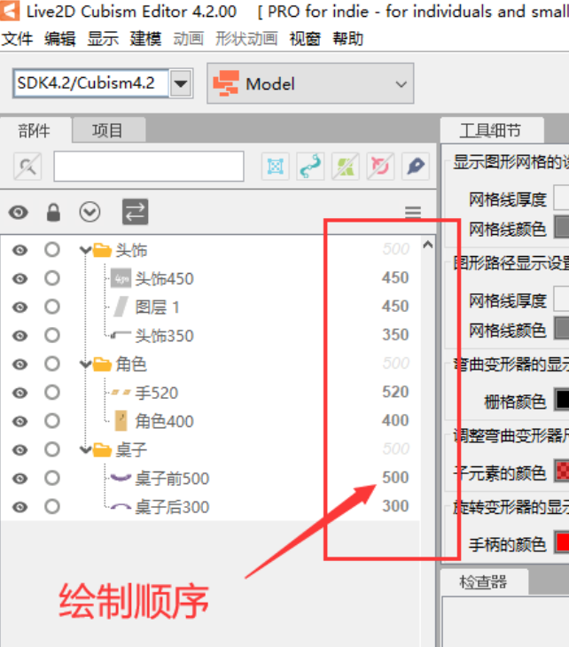
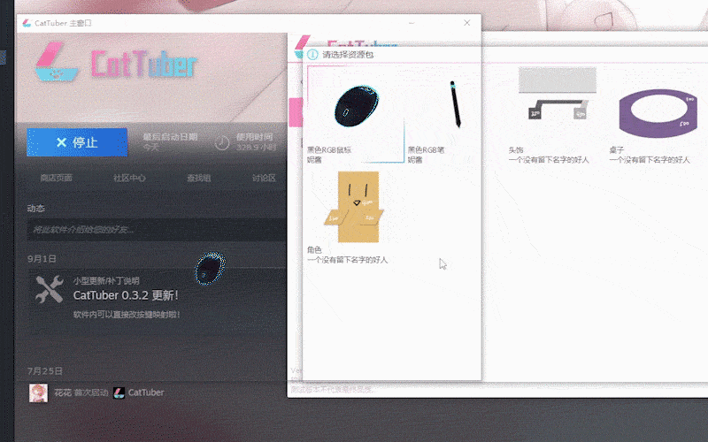

# Cómo CatTuber muestra los modelos
En la versión actual, CatTuber no tiene la función de mover o ajustar individualmente el tamaño de un modelo individual. El lienzo del modelo siempre estará centrado y tendrá la misma altura que la altura de la ventana.

La pantalla de CatTuber está compuesta por varios modelos. Para asegurarte de que las posiciones de los diferentes modelos estén dentro de lo esperado, se recomienda que el tamaño y la proporción de los lienzos del modelo que deben aparecer juntos sean iguales. De esta manera, si la relación entre la posición del personaje, el mouse y la mesa es correcta en Cubism Editor, también se mantendrá correcta en CatTuber.

### Orden de dibujo de los modelos Live2D en CatTuber
En la actualización 0.4.0, CatTuber implementó la mezcla y renderizado de modelos Live2D, lo que significa que todas las capas de todos los modelos dentro de la ventana se ordenarán y dibujarán de acuerdo al orden de dibujo especificado en Live2D Cubism Editor.

La disposición vertical de las capas con el mismo orden de dibujo en diferentes modelos dependerá de las posiciones relativas de los modelos en la página de configuración de contenido de CatTuber.

