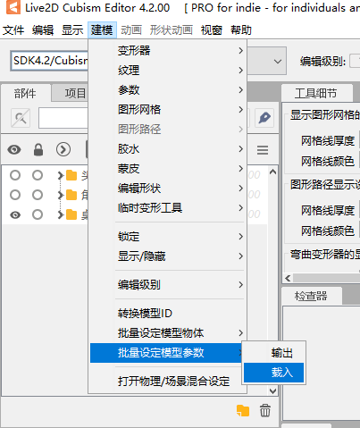

# Cómo hacer un modelo de personaje

### Preparación de ilustraciones (¿ilustración sentado?)
No hay mucho que destacar aquí. Por consideraciones de movimiento de cabeza y físicas para personajes con cabello largo, asegúrate de dejar suficiente espacio debajo de la mesa para el cabello. En el archivo PSD, puedes incluir capas para la mesa, el mouse y el lápiz que no serán exportadas en la versión final (también puedes copiarlas de otros documentos de proyectos de Live2D durante la creación del modelo).

Si estás siguiendo el estándar de modelos oficial, puedes copiar el archivo PSD del modelo de demostración y modificar directamente las partes relacionadas con las características del personaje.

### Preparación antes de modelar
Abre Live2D Cubism Editor, importa el archivo PSD del modelo de personaje al editor y organiza las capas de referencia en el orden de dibujo correcto. Luego, organiza las capas individuales del modelo de personaje en el orden de dibujo correcto. [Reglas de orden de capas usadas en los modelos oficiales de CatTuber.](Reglas%20de%20orden%20de%20capas%20en%20modelos%20oficiales%20de%20CatTuber)

Elimina todos los parámetros y luego importa los ["parámetros básicos de personajes en CatTuber"](../../models/CatTuber角色基础参数0_4_0.csv) desde el repositorio al editor. Para detalles sobre cómo modelar estos parámetros, consulta los ejemplos de modelos de personajes en este repositorio.



Algunos de los parámetros importados están planeados para su uso futuro y no se utilizan en la versión actual, como los parámetros relacionados con la boca y las cejas. Puedes elegir si deseas modelarlos o no.

Para obtener información detallada sobre el propósito de cada parámetro, consulta el archivo cmo3 del modelo de demostración abriéndolo en el editor.

### Modelación de las manos
Si sigues el **estándar de modelos**, las manos de diferentes modelos deberían ubicarse al menos de manera similar cuando se activan los mismos parámetros de posición XY.

Por lo general, se recomienda copiar y reutilizar directamente las partes de las manos que tienen el mismo estándar. Si existe casos en los que necesitas remodelar las manos, como cuando "las mangas de la ropa cubren demasiado las manos" o "necesitas crear manos mecánicas", también deberás copiar las partes de las manos con el mismo estándar para usarlas como referencia durante la modelación.

Algunos puntos clave en los parámetros de las manos oficiales están colocados para evitar deformaciones antiestéticas. Para que la posición de las manos sea consistente con las manos oficiales, puedes usar las coordenadas X de `-30, 0 y 30`, y las coordenadas Y de `-30, 0 y 30`. Mantén la posición coherente en estos 9 puntos clave (es decir, primero ajusta la posición en los 9 ejes y luego agrega puntos clave para eliminar deformaciones antiestéticas).

*El movimiento de levantar la mano (parámetro `"Up"` de la mano) en CatTuber no ocurre instantáneamente, sino que toma varios fotogramas. Si deseas un movimiento fluido al levantar la mano, durante la modelación, debes asegurarte de que no haya deformaciones notables en el modelo de la mano en todas las posiciones XY y para todos los valores de `"Up"` en el rango [0,1]. Si prefieres que el levantamiento de la mano sea instantáneo, puedes añadir un punto clave en `"Up"` en `0.1` y copiar la forma desde Up en `1`.

[Agregar una tercera mano o más](#modificar-el-número-de-manos) 

### Exportación del modelo
Selecciona la opción de exportación "SDK for Native 4.0". **Asegúrate de que los nombres de los archivos de modelo y animación exportados desde el editor no contengan caracteres chinos ni caracteres de ancho completo.**

### Expresiones y animaciones
En la versión actual, CatTuber no cuenta con un sistema completo de expresiones y animaciones, principalmente debido a que el sistema de eventos de CatTuber aún no está completamente desarrollado. Se espera poder controlar las expresiones y animaciones del personaje a través de este sistema de eventos, como emitir un evento cuando se presiona una tecla con una frecuencia determinada, y el modelo del personaje responderá con una expresión o animación específica.

Sin embargo, las animaciones en modo inactivo ("Idle") son compatibles. Puedes agregar animaciones a la categoría "Idle" a través de Live2D Cubism Viewer o editar el archivo `*.model3.json` manualmente.

<h3 id="modificar-el-número-de-manos">Creación del archivo de configuración para determinar los parámetros de las manos en estado de reposo/activación y modificar el número de manos</h3>

En CatTuber, el personaje pasa al estado de reposo cuando la frecuencia de pulsación de teclas es baja, y al estado de activación en caso contrario.

En cada estado, las manos se colocan en diferentes posiciones cuando se levanta la mano de las teclas, y estas posiciones deben especificarse en el archivo de configuración.

El nombre del archivo de configuración debe ser el mismo que el nombre del paquete de recursos o del nombre de la carpeta considerada como paquete de recursos. Aquí hay un ejemplo de configuración:


defaultCharacter.json:
```json
{
	"HandList":
	[
	[19.3,-30,0,0.8],
	[-21.1,-22.9,0,0.8]
	]
}
```
"HandList" es una matriz bidimensional donde la primera dimensión representa el número de la mano, y la segunda dimensión contiene cuatro valores que indican la posición objetivo de esa mano en diferentes estados.

El ejemplo anterior indica que en el estado de reposo del modelo defaultCharacter, después de soltar la tecla, la mano derecha se moverá lentamente a la posición `X:19.3`, `Y:-30`, `Up:0`. La mano izquierda se moverá lentamente a la posición `X:-21.1`, `Y:-22.9`, `Up:0`, es decir, adoptará una posición de mano apoyada sobre la mesa. El último valor en los cuatro números de la matriz representa la altura de la mano en el estado de activación (valor Up). En CatTuber, la posición XY después de levantar la mano en el estado de activación no se especifica en el archivo de configuración, sino que se determina según la posición en la que se levanta la mano. Por ejemplo, si la mano derecha está en la posición `X:-10`, `Y:10`, `Up:0` en el momento de presionar la tecla, según el archivo JSON mencionado anteriormente, la mano derecha se elevará a la posición `X:-10`, `Y:10`, `Up:0.8` cuando se levante.

El contenido del archivo JSON mencionado anteriormente es también la configuración predeterminada utilizada en CatTuber. Si sigues el estándar oficial de CatTuber y no necesitas cambiar la posición de levantamiento de las manos en diferentes estados, no necesitas crear este archivo JSON.

Si es necesario, puedes agregar más conjuntos de valores a la matriz en "HandList" para agregar más manos. Para la tercera mano y posteriores, los parámetros de Live2D necesarios son `CAT_Hand[i]X`, `CAT_Hand[i]Y`, y `CAT_Hand[i]Up`. Reemplaza `"[i]"`, con el número de la mano. Por ejemplo, `CAT_Hand3X` sería el parámetro X de la tercera mano.

### Importación en CatTuber

1. Crea una nueva carpeta y dale el nombre de tu modelo (este nombre puede contener caracteres chinos y se mostrará en la interfaz de selección de modelos de CatTuber).
2. Coloca una imagen PNG de 256x256 llamada Cover.png en esta carpeta.
3. Crea una subcarpeta llamada "l2dmodel" dentro de esta carpeta y coloca en ella los archivos de modelo y animación exportados desde el editor. **Renombra el archivo** `*.model3.json` **a** `cat.model3.json`**. Asegúrate de que los nombres de los archivos de modelo y animación exportados desde el editor no contengan caracteres chinos ni otros caracteres de ancho completo.**
4. Coloca el contenido mencionado en la carpeta "Resources\Character" dentro de la carpeta de CatTuber.
5. Coloca un archivo de configuración con el mismo nombre al lado de la carpeta.

**Esta imagen es un ejemplo de la ruta del modelo de personaje; el modelo de personaje se encuentra en Resources\Character.**


### Otros

CatTuber se usa principalmente para fines decorativos y no debería consumir demasiados recursos para juegos, skins o codificadores de transmisión en vivo. Por lo tanto, aquí se sugiere a los nuevos modeladores que crean modelos para otros que tengan en cuenta la cantidad de polígonos y sean razonables al crear modelos para evitar un exceso de triángulos.
