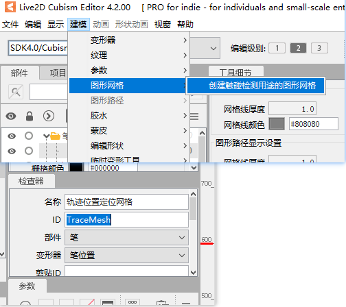

# Cómo hacer un modelo de objeto sostenido
Los objetos sostenidos en CatTuber son elementos interactivos como mouses y lápices digitales que se sostienen en la mano y no están en la mesa.

### Preparación de ilustraciones (¿ilustración?)
Es importante tener en cuenta que aunque los objetos sostenidos son pequeños, aún deben tener el mismo tamaño de lienzo que otros modelos dentro del mismo **estándar de modelados**.

Cuando comencé a desarrollar esto, utilicé la versión 4.0 del SDK y del Editor. Todavía no he migrado a la versión 4.2. La función de cambio de color en la versión 4.2 del Live2D Cubism Editor actualmente no es compatible con CatTuber. En la versión actual de CatTuber, el cambio de color en los modelos de objetos sostenidos se logra controlando los parámetros `CAT_Theme_R`, `CAT_Theme_G` y `CAT_Theme_B`. Si deseas cambiar el color de un objeto en CatTuber, como el resplandor RGB del ratón, debes preparar tres capas de colores sólidos: rojo, verde y azul (puedes obtener estas capas de canales de color puro mediante la técnica de "multiplicación"), y configurar las capas con el modo `"Sumar"` en el editor de Live2D para lograr la síntesis de colores. En el futuro, CatTuber intentará ser compatible la versión 4.2 del SDK.

### Preparación antes de modelar
Abre Live2D Cubism Editor e importa el archivo PSD del modelo de mesa.

Los parámetros por defecto proporcionados por el editor de Live2D para la mesa no son necesarios, elimina todos los parámetros. Luego importa los ["parámetros de objeto sostenido de CatTuber"](../../models/CatTuber手持物参数.csv) en el Live2D Cubism Editor. Estos parámetros importados incluyen aquellos relacionados con los botones del mouse. Al igual que con la mesa, estos parámetros se pueden personalizar. No es obligatorio usarlos, pero si tus datos para el objeto sostenido solo se relacionan con el mouse, te sugiero que uses los parámetros importados, ya que esto reducirá la carga de trabajo posterior. Los parámetros importados incluyen 8 botones del mouse y parámetros relacionados con la rueda, pero puedes modelar solo los parámetros que realmente necesitas. No estoy seguro de qué representan los otros tres botones del mouse aparte de los botones izquierdo, central y derecho. (Si tienes dispositivos de entrada extraños, puedes intentar usar el programa de consulta de botones en este repositorio).

### Proceso de modelado
Al modelar, asegúrate de copiar un modelo de personaje estándar en el archivo de trabajo actual como referencia. Puede haber varios puntos clave para la posición de la mano, pero generalmente basta con usar 9 puntos de ubicación en las coordenadas XY: `-30`, `0`, `30`. Ten en cuenta que en el estándar oficial de CatTuber, el orden de dibujo para el ratón es `506` y para el lápiz digital es `600.

### Trazo del lápiz
CatTuber utiliza una malla gráfica especial para marcar la posición de la punta del lápiz. En el Live2D Cubism Editor, crea una malla gráfica para detectar colisiones y asigna el ID de esta malla como `TraceMesh`.

Asegúrate de que el punto central de esta malla esté siempre en la punta del lápiz ya que CatTuber generará el trazo en este punto central. (El orden de dibujo para el trazo generado es 505).

### Exportación del modelo
Selecciona la opción de exportación "SDK for Native 4.0". **Asegúrate de que los nombres de los archivos de modelo y animación exportados desde el editor no contengan caracteres chinos ni caracteres de ancho completo.**

### Expresiones y animaciones
En la versión actual, CatTuber no cuenta con un sistema completo de expresiones y animaciones. Sin embargo, las animaciones en modo inactivo ("Idle") son compatibles. Puedes agregar animaciones a la categoría "Idle" a través de Live2D Cubism Viewer o editar el archivo `*.model3.json` manualmente.

### Creación del archivo de configuración
La creación de este archivo y su contenido es similar al de la mesa. Si estás usando directamente los ["parámetros de objeto sostenido de CatTuber"](../../models/CatTuber手持物参数.csv) y no necesitas agregar o modificar botones, puedes simplemente copiar y renombrar `"blackRGBmouse.json"` como el archivo de configuración para el mouse, evitando así escribirlo manualmente. Si necesitas crearlo desde cero, también puedes usar `"blackRGBmouse.json"` como referencia.

El campo `"FollowPluginSettings"` dentro de `"ThemeColor"` indica si el control del color principal debe ser manejado por el software. Si está en `"true"`, los usuarios podrán cambiar el color o los efectos de color en la página de configuración del objeto sostenido.

El campo `"ColorEffect"` especifica el efecto de color. Actualmente solo hay un efecto llamado `"rainbowGradient"` (un degradado de colores RGB) y `"period"` indica la duración de un ciclo de efecto.

El campo `"ColorValue"` especifica el valor inicial del color.

Si tu modelo no necesita permitir ajustes de color en la interfaz de configuración de CatTuber, puedes eliminar los campos `"ThemeColor"` o `"ColorEffect"`.

La sección `"ButtonList"` describe la lista de botones. Aquellos botones con la etiqueta `"tag":"trace"` se usarán para activar el trazo del lápiz. Por ejemplo, si agregas esta etiqueta al botón izquierdo, el trazo solo se generará cuando se presione el botón izquierdo (en realidad, esto dependerá de la configuración en el archivo de la mesa; algunas mesas pueden generar trazos solo cuando se presiona un botón, mientras que otras pueden forzar que siempre se generen trazos sin importar de si se presiona un botón o no).

Para obtener más información sobre la configuración de `"ButtonList"` y otros aspectos, consulta el [archivo de configuración de la mesa](Archivo%20de%20configuración%20de%20la%20mesa.md).

### Importación en CatTuber
1. Crea una nueva carpeta y dale el nombre de tu modelo (este nombre puede contener caracteres chinos y se mostrará en la interfaz de selección de modelos de CatTuber).
2. Coloca una imagen PNG de 256x256 llamada Cover.png en esta carpeta.
3. Crea una subcarpeta llamada "l2dmodel" dentro de esta carpeta y coloca en ella los archivos de modelo y animación exportados desde el editor. **Renombra el archivo** `*.model3.json` **a** `cat.model3.json`**. Asegúrate de que los nombres de los archivos de modelo y animación exportados desde el editor no contengan caracteres chinos ni otros caracteres de ancho completo.**
4. Coloca el contenido mencionado en la carpeta "Resources\HandheldItem" dentro de la carpeta de CatTuber.
5. Coloca un archivo de configuración con el mismo nombre al lado de la carpeta.

**Esta imagen es un ejemplo de la ruta del modelo de objeto sostenido; el modelo de objeto sostenido se encuentra en Resources\HandheldItem.**

