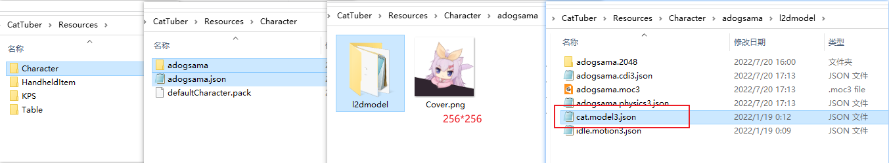

# Cómo hacer un modelo de KPS
El modelo de KPS en CatTuber se utiliza para mostrar la cantidad de pulsaciones de teclas por segundo que realiza el usuario en tiempo real.

### Preparación de ilustraciones (¿ilustración?)
El modelo de KPS se utiliza como una decoración independiente y no forma parte del **estándar de modelos**. Debes preparar ilustraciones de los números del 0 al 9, el punto decimal y el fondo según lo que desees.

Se recomienda utilizar el tamaño de lienzo del modelo oficial al realizar el modelado, y ubicar el modelo de KPS en una esquina del lienzo.

### Preparación antes de modelar
Abre Live2D Cubism Editor e importa el archivo PSD del modelo de KPS.

Los parámetros por defecto proporcionados por el editor de Live2D para el KPS no son necesarios, elimina todos los parámetros. Luego importa los ["parámetros de KPS de CatTuber"](../../models/CatTuberKPS参数.csv) desde el repositorio al editor.

El modelo de KPS pertenece a la categoría de HUD (pantalla de visualización). Por lo general, se recomienda establecer el orden de dibujo de las capas en 1000.

### Proceso de modelado
El software usará los cinco parámetros importados según sus propios datos. Cuatro de estos parámetros controlan los cambios en los dígitos individuales, mientras que un parámetro de KPS controla el cambio general del modelo. Estos datos se basan en los valores específicos actuales de KPS. **Los cuatro parámetros que controlan los cambios en los dígitos no cambian de manera continua, sino que toman solo números enteros del 0 al 9.**

### Exportación del modelo
Selecciona la opción de exportación "SDK for Native 4.0". **Asegúrate de que los nombres de los archivos de modelo y animación exportados desde el editor no contengan caracteres chinos ni caracteres de ancho completo.**

### Expresiones y animaciones
En la versión actual, CatTuber no cuenta con un sistema completo de expresiones y animaciones. Sin embargo, las animaciones en modo inactivo ("Idle") son compatibles. Puedes agregar animaciones a la categoría "Idle" a través de Live2D Cubism Viewer o editar el archivo `*.model3.json` manualmente.

En KPS, el software proporcionará control sobre la opacidad del modelo para lograr un efecto de aparición gradual cuando se ingrese una pulsación de tecla, así como un efecto de desvanecimiento gradual cuando no hay entrada durante un período prolongado. No necesitas realizar ninguna configuración.

Si deseas reemplazar este efecto de aparición o desaparición con tus propias animaciones, puedes agregar animaciones que expresen la aparición del modelo al grupo de movimientos llamado "Appear"; y agregar animaciones que expresen la desaparición del modelo al grupo de movimientos llamado "Disappear".

### Creación del archivo de configuración
Si deseas aplicar un efecto especial al modelo de KPS cada vez que se presiona una tecla, puedes crear un archivo de configuración. Sin embargo, este archivo no es obligatorio para el modelo de KPS.

Ejemplo:
```json
{
  "Version":2,
  "effects":[
	  {
		  "paramID":"CAT_KPS_SCALE",
  		"effectType":"sawtooth",
	  	"period":0.2,
		  "trigger":"down"
	  }
  ]
}
```
El campo `"Version"` indica cómo el software debe leer el archivo de configuración. Actualmente, solo se admite el valor `2`.

El campo "effects" es una matriz que puede contener varios efectos. En el ejemplo, solo hay un efecto que indica que cada vez que se presiona una tecla, el valor del parámetro con ID `"CAT_KPS_SCALE"` aumentará abruptamente a 1 y luego disminuirá a 0 en 0.2 segundos. Esto crea un efecto de salto en el modelo de KPS al presionar una tecla.

Para obtener obtener información detallada sobre "effects", consulta los [efectos de parámetros "effects"](Efectos%20de%20parámetros%20de%20mesa.md).

### Importación en CatTuber
1. Crea una nueva carpeta y dale el nombre de tu modelo (este nombre puede contener caracteres chinos y se mostrará en la interfaz de selección de modelos de CatTuber).
2. Coloca una imagen PNG de 256x256 llamada Cover.png en esta carpeta.
3. Crea una subcarpeta llamada "l2dmodel" dentro de esta carpeta y coloca en ella los archivos de modelo y animación exportados desde el editor. **Renombra el archivo** `*.model3.json` **a** `cat.model3.json`**. Asegúrate de que los nombres de los archivos de modelo y animación exportados desde el editor no contengan caracteres chinos ni otros caracteres de ancho completo.**
4. Coloca el contenido mencionado en la carpeta "Resources\KPS" dentro de la carpeta de CatTuber.
5. Coloca un archivo de configuración con el mismo nombre al lado de la carpeta.

**Esta imagen es un ejemplo de la ruta del modelo de KPS; el modelo de KPS se encuentra en Resources\KPS.**


