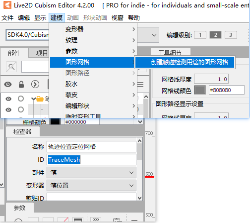

# 制作手持物模型

CatTuber中手持物指鼠标、数位笔这种与手有互动又独立于桌子的物品。

### 立绘准备（立绘？？？）

请注意，手持物虽然是小物件，但是建模时依然需要使用与同模型标准内其他模型一致的画布大小。

我开始进行相关开发的时候使用的是4.0版本的SDK和Editor，还没开始使用4.2版本，Live2D Cubism Editor 4.2版本的变色功现在在CatTuber中无法使用。CatTuber目前版本中手持物模型的变色功能是控制CAT_Theme_R、CAT_Theme_G、CAT_Theme_B这三个参数来实现的。如果你需要在CatTuber内改变物体的主题色，如RGB鼠标的辉光，你可以为你想要变色的部分准备纯红、纯绿、纯蓝三个图层（可以通过纯色的正片叠底获得纯色通道的图层），在Live2D编辑器中将它们设置为”加算“即可实现颜色的合成。CatTuber后续将尝试支持4.2版本的SDK。


### 开始建模前的准备

打开Live2D Cubism Editor，将桌子模型PSD文件导入编辑器中。

Live2D编辑器提供的默认参数桌子用不上，删除所有参数，将存储库里的“CatTuber手持物参数.csv”导入Live2D Cubism Editor中。导入的参数包含了与鼠标按键有关的参数，按键参数和桌子类似，是可以自行指定的，你不是必须使用它们，但如果你的手持物数据来源只有鼠标的话，我建议就直接使用导入的参数，因为可以减少后续的工作量。导入的参数中包含了8个鼠标按键以及滚轮相关的参数，你可以只对能用上的参数都进行建模，我也不知道除了左键中键右键和两个侧键之外的另外三个鼠标按键是啥。（但如果你有奇怪的输入设备，或许可以试试这个存储库中的按键查询程序。）


### 建模流程

建模时请将同标准的角色模型复制到当前工作档内作为参考。手的位置参数可能会有多个关键点，但是一般用XY的-30、0、30的9个点做定位就好。请注意CatTuber的官方标准中，鼠标的绘制顺序在506，数位笔的绘制顺序在600。

### 笔轨迹

CatTuber中使用特殊图形网格对笔尖位置进行标记。在Live2D Cubism Editor中创建检测碰撞用途的图形网格，将此网格ID设置为```TraceMesh``` 。



使其中心点一直处于笔尖上，CatTuber会在这个中心点上生成笔迹。（生成的笔迹的绘制顺序为505）。


### 模型导出

请选择SDK for Native 4.0 导出。**请注意编辑器导出的模型和动画文件名不要有中文或其他全角字符。**

### 表情和动画

当前版本CatTuber没有完善的表情和动画系统，但是待机动画是受支持的，待机动画的组名是"Idle"，可以通过Live2D Cubism Viewer添加动画或者手动编写*.model3.json文件。

### 编写配置文件

编写方法和内容与桌子类似，但如果你直接使用了“CatTuber手持物参数.csv”，并且不需要增改按键的话，你可以直接拷贝并重命名"blackRGBmouse.json"来作为自制鼠标的配置文件，不需要再手动编写。需要自己编写时，也可以把"blackRGBmouse.json"做为参考。

"ThemeColor"内的"FollowPluginSettings"标识对主题色的控制是否交给软件设置，如果为true，那么用户就可以在手持物的设置页面中改变颜色或者颜色特效。

"ColorEffect"指定颜色特效，目前只有"rainbowGradient"这一种特效（效果为RGB颜色渐变），"period"表示一个特效周期的时长。

"ColorValue"指定颜色的初始值。

如果你的模型不需要在CatTuber设置界面设置颜色或颜色特效，你可以删除掉"ThemeColor"或"ColorEffect"字段。

"ButtonList"表示按键表，其中带有"tag":"trace"项的按键将作为输出轨迹的标志。如在左键上加这个tag项将表示在左键按下时才输出轨迹（实际上需要视桌子的配置文件决定具体输出情况，桌子可以决定是按键输出轨迹还是强行输出轨迹，软件中的绘画桌即按键输出轨迹；osu!桌即无论是否按键都强行输出轨迹）。

"ButtonList"及其他内容的配置请参考[桌子的配置文件](docs/%E6%A1%8C%E5%AD%90%E7%9A%84%E9%85%8D%E7%BD%AE%E6%96%87%E4%BB%B6.md)。

### 导入CatTuber中

1.  新建一个文件夹，将其命名为你的模型名（这个名字可以用中文，会于软件的模型选择界面显示）。
2.  在这个文件夹中放入一张名为Cover.png的256*256的png图片。
3.  在这个文件夹中新建一个名为l2dmodel的文件夹，在其中放入从编辑器导出的模型和动画文件，**将*.model3.json更名为cat.model3.json**。**请注意编辑器导出的模型和动画文件名不要有中文或其他全角字符。**；
1.  将上述内容放到CatTuber文件夹中的Resources\HandheldItem文件夹里；
2.  在旁边放置与文件夹同名配置文件。

**此图为角色模型的路径示例，手持物模型在Resources\HandheldItem**

