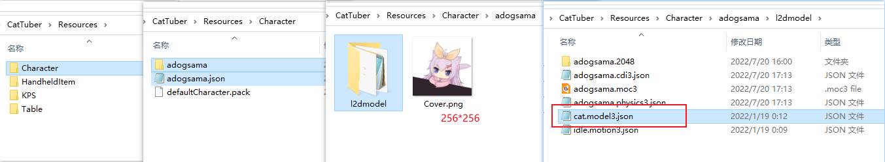

  

# 制作KPS模型

CatTuber中KPS模型用来显示用户当前的每秒按键次数。

### 立绘准备（立绘？？？）

KPS模型作为独立的装饰并不在模型标准之中，根据你需要的画面准备0~9的数字、小数点、背景素材即可。

建议建模时采用官方模型的画布大小，并让KPS处于画布的角落。


### 开始建模前的准备

打开Live2D Cubism Editor，将KPS模型PSD文件导入编辑器中。

Live2D编辑器提供的默认参数KPS用不上，删除所有参数，将存储库里的“CatTuberKPS参数.csv”导入Live2D Cubism Editor中。

KPS模型属于HUD，一般将各图层绘制顺序设置为1000


### 建模流程

软件会根据自身的数据控制导入的五个参数，其中四个参数用于控制各个数字的变化，一个KPS参数控制整体变化，它们的数据都来自当前具体的KPS数值。**控制数字变化的四个参数并不是连续变化的，它的数值只为0~9的整数**。


### 模型导出

请选择SDK for Native 4.0 导出。**请注意编辑器导出的模型和动画文件名不要有中文或其他全角字符。**

### 表情和动画

当前版本CatTuber没有完善的表情和动画系统，但是待机动画是受支持的，待机动画的组名是"Idle"，可以通过Live2D Cubism Viewer添加动画或者手动编写*.model3.json文件。

在KPS中，软件会提供对模型透明度的控制来实现有按键输入时的渐入效果和长时间无输入的渐出效果，你不需要进行任何设置。

如果你想用自己的动画去覆盖这个出现或消失的效果的话，可以向组名为"Appear"的motion组中添加表达模型出现的动画；向组名为"Disappear"的motion组中添加表达模型消失的动画。

### 编写配置文件

如果你需要每次按键时给KPS模型一个特效的话可以编写一个配置文件。这个文件对KPS模型不是必须的。

示例：
```json
{
"Version":2,
"effects":[
	{
		"paramID":"CAT_KPS_SCALE",
		"effectType":"sawtooth",
		"period":0.2,
		"trigger":"down"
	}
]
}
```
"Version"告知软件读取配置文件的方式，目前只设置2。

"effects"是个数组，里面可以放如多个effct效果，示例中只有一个效果，表示每当有按键按下时ID为CAT_KPS_SCALE的参数数值将突变为1，然后再0.2秒的时间里降低到0。它可以实现按键时KPS模型跃动的效果。

有关"effects"的详细信息请参考[# 参数特效"effects"](Table_Effects_CN.md)。

### 导入CatTuber中

1.  新建一个文件夹，将其命名为你的模型名（这个名字可以用中文，会于软件的模型选择界面显示）。
2.  在这个文件夹中放入一张名为Cover.png的256*256的png图片。
3.  在这个文件夹中新建一个名为l2dmodel的文件夹，在其中放入从编辑器导出的模型和动画文件，**将*.model3.json更名为cat.model3.json**。**请注意编辑器导出的模型和动画文件名不要有中文或其他全角字符。**；
1.  将上述内容放到CatTuber文件夹中的Resources\HandheldItem文件夹里；
2.  在旁边放置与文件夹同名配置文件。

**此图为角色模型的路径示例，KPS模型在Resources\KPS**

